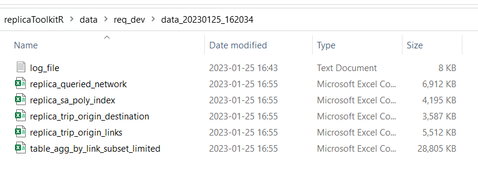
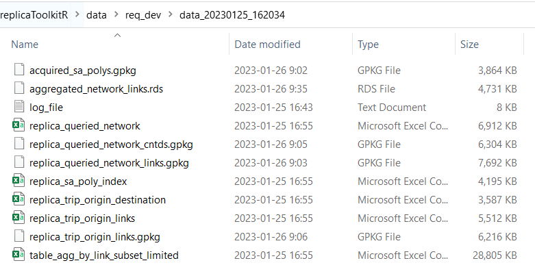

# replicaToolkitR

[](https://www.tidyverse.org/lifecycle/#experimental)
<!-- badges: end -->

This R package provides a set of functions which allow the user to interact with and download data from the Replica data platform. 

The usage of this package requires the user to have an account with Replica. 

## Installation

Install the development version from GitHub:

``` r
# install.packages("devtools")
devtools::install_github("michaelgaunt404/replicaToolkitR")
```

## Usage

Load the package.

``` r
library(replicaToolkitR)

```
The run the function `query_network_trip_using_bbox()` to query the replica database given your supplid inputs.

``` r
query_network_trip_using_bbox(
  bb_network_layer = 'data/req_dev/study_area_network.shp'
  ,bb_sa_layer = 'data/req_dev/study_area_network.shp'
  ,network_table = "replica-customer.northwest.northwest_2021_Q4_network_segments"
  ,trip_table = "replica-customer.northwest.northwest_2021_Q4_thursday_trip"
  ,customer_name = "replica-customer"
  ,file_destination = "data/req_dev"
  ,max_record = Inf
  ,query_links = c("highway", "corridor", "road", "motorway", "motorway_link", "trunk",
                   "trunk_link", "primary", "primary_link", "secondary", "secondary_link")
)
```
The above function will run and, at times, ask you for inputs that will either continue or terminate the run. 

## Output

When completed, the queried data will be written to the location defined by the input `file_destination`.

6 files will be written, they are: 
+ `log_file`: Simple text file logging the events of the run. Records the table IDs of the temporary tables that are made in Google BigQuery table during the run. These can be accessed later.
+ `replica_queried_network`: The network queried by the user. The user will be asked if they want to download this file or not - it can be rather large given query inputs. 
+ `replica_sa_poly_index`: A table containg all polygons found within the user supplied bb_sa_layer polygon.
+ `replica_trip_origin_destination`: A table containing counts of vehicles aggregated by origin polygon, destination polygon, and vehicle type. Origins and destinations outside of the study area are collapsed into single level called `out of study area`.
+ `replica_trip_origin_links`: A table containg counts of vehicle given origin polygon and starting network link. This data set provides a more precise view of vehicle starting locations rather than by its origin polygon (usually census block groups). This is useful when performing hotspot analyses or calcualting kernel desnity estimates (KDEs).
+ `table_agg_by_link_subset_limited`: A table detailing network link volumes for a given day aggregated by origin polygon and network link

All the data listed above are save as CSVs. Conveince functions are provided to convert tabular data to spatial data and save as GPKG or RDS files. 

Resulting files in folder after data acquisition.



## Data Processing 

As indcated above, `replicaToolkitR` provides convience functions to convert the tabular data acquired through `query_network_trip_using_bbox()` to a spatail format conducive to mapping.  

> **_NOTE:_** The functions in this section can be supplied an object to transfrom or location/folder inputs that point to where your data is saved. If the latter is supplied then the function will go and automatically load whatever file the function calls for. Suppling an object directly is compataible with the `targets` package workflow.

Acquire origin polygons from the `tigris` census API package using `replica_sa_poly_index`.
``` r
data("replica_sa_poly_index")

get_tigris_polys_from_replica_index(
  network_object = replica_sa_poly_index
  ,states = "WA"
  ,auto_save = F
)
```
Make `SF` linestring spatial object of network links. 
``` r
data("replica_queried_network")

make_network_link_layer(
  network_object = replica_queried_network
  ,auto_save = F
)
```
Make `SF` point spatial object by extracting center points from network links.
``` r
data("replica_queried_network")

make_network_centroid_layer(
  network_object = replica_queried_network_links
  ,auto_save = F
)
```
`SF` point spatial object of trip first link aggregation table.
``` r
data("replica_trip_origin_links")

make_trip_origin_point_layer(
  first_links_object = replica_trip_origin_links
  ,auto_save = F
)
```

Make RDS list object containg network link counts aggregated three different pre-set ways.
``` r
data("table_agg_by_link_subset_limited")

aggregate_network_links(
  network_object = table_agg_by_link_subset_limited
  ,auto_save = F
)
```
Resulting files in folder after processing.



> **_NOTE:_** This functions will always return an object. If you do not choose to `auto_save` you will still be returned the result. It is advised to `auto_save` the object at _some point_ as naming conventions will be respected.

