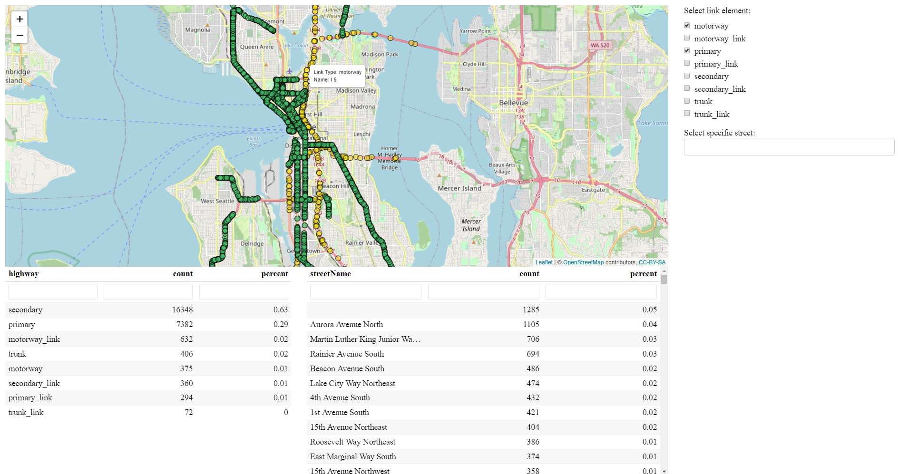

# replicaToolkitR

[](https://www.tidyverse.org/lifecycle/#experimental)
<!-- badges: end -->

This R package provides a set of functions which allow the user to query and process Replica data. Using user inputs, SQL queries area made to the Replica Big Query database. The results of those queries are returned to the user in the form of CSVs. Convenience functions are used to convert tabular data to spatial `SF` objects. 

#### Intent of this package:

This package is intended to lower the overhead when working with Replica data. Specifically, to make it extremely easy with little cost to acquire Replica data and to produce some basic analytic tools (dashboards) to quickly gain useful insights.  

#### What you can do with this package:
    
:heavy_check_mark: Make queries directly to and acquire data from Replica's Big Query database using your own inputs and custom geometry     
:heavy_check_mark: Create data sets from your queries and use them to: 
    
+ Quantify trip ODs  
+ Aggregate network link volumes  
+ Produce trip origin kernel density estimates (KDE)   
+ Identify trip origin hotspots and coldspots  

:heavy_check_mark: Create interactive, filterable map widgets that help you further inspect your data 

> **_NOTE:_** The usage of this package requires the user to have an account with Replica and access to Google BigQuery via Replica. 

## Installation

Install the development version from GitHub:

``` r
# install.packages("devtools")
devtools::install_github("michaelgaunt404/replicaToolkitR")
```

## Usage

Load the package.

``` r
library(replicaToolkitR)

```
The run the function `query_network_trip_using_bbox()` to query the replica database given your supplied inputs.
``` r
query_network_trip_using_bbox(
  bb_network_layer = 'data/req_dev/study_area_network.shp'
  ,bb_sa_layer = 'data/req_dev/study_area_network.shp'
  ,network_table = "replica-customer.northwest.northwest_2021_Q4_network_segments"
  ,trip_table = "replica-customer.northwest.northwest_2021_Q4_thursday_trip"
  ,customer_name = "replica-customer"
  ,file_destination = "data/req_dev"
  ,max_record = Inf
  ,query_links = c("highway", "corridor", "road", "motorway", "motorway_link", "trunk",
                   "trunk_link", "primary", "primary_link", "secondary", "secondary_link")
)
```
The above function will run and, at times, ask you for inputs that will either continue or terminate the run. 

## Output

When completed, the queried data will be written to the location defined by the input `file_destination`.

6 files will be written, they are: 
    
+ `log_file`: Simple text file logging the events of the run. Records the table IDs of the temporary tables that are made in Google Big Query table during the run. These can be accessed later.   
+ `replica_queried_network`: The network queried by the user. The user will be asked if they want to download this file or not - it can be rather large given query inputs.    
+ `replica_sa_poly_index`: A table containing all polygons found within the user supplied bb_sa_layer polygon.   
+ `replica_trip_origin_destination`: A table containing counts of vehicles aggregated by origin polygon, destination polygon, and vehicle type. Origins and destinations outside of the study area are collapsed into single level called `out of study area`.   
+ `replica_trip_origin_links`: A table containing counts of vehicle given origin polygon and starting network link. This data set provides a more precise view of vehicle starting locations rather than by its origin polygon (usually census block groups). This is useful when performing hotspot analyses or calculating kernel density estimates (KDEs).   
+ `table_agg_by_link_subset_limited`: A table detailing network link volumes for a given day aggregated by origin polygon and network link    

All the data listed above are save as CSVs. Helper functions are provided to convert tabular data to spatial data and save as GPKG or RDS files. 

Resulting files in folder after data acquisition.


## Data Processing 

As indicated above, `replicaToolkitR` provides helper functions to convert the tabular data acquired through `query_network_trip_using_bbox()` to a spatial format conducive to mapping.  

> **_NOTE:_** The functions in this section can be supplied an object to transfrom or location/folder inputs that point to where your data is saved. If the latter is supplied then the function will go and automatically load whatever file the function calls for. Suppling an object directly is compataible with the `targets` package workflow.

Acquire origin polygons from the `tigris` census API package using `replica_sa_poly_index`.
``` r
data("replica_sa_poly_index")

get_tigris_polys_from_replica_index(
  network_object = replica_sa_poly_index
  ,states = "WA"
  ,auto_save = F
)
```
Make `SF` line-string spatial object of network links. 
``` r
data("replica_queried_network")

make_network_link_layer(
  network_object = replica_queried_network
  ,auto_save = F
)
```
Make `SF` point spatial object by extracting center points from network links.
``` r
data("replica_queried_network")

make_network_centroid_layer(
  network_object = replica_queried_network_links
  ,auto_save = F
)
```
`SF` point spatial object of trip first link aggregation table.
``` r
data("replica_trip_origin_links")

make_trip_origin_point_layer(
  first_links_object = replica_trip_origin_links
  ,auto_save = F
)
```

Make RDS list object containing network volume aggregation tables.
``` r
data("table_agg_by_link_subset_limited")
data("poi_list")
data("replica_queried_network_cntds")

aggregate_network_links(
  agg_count_object = table_agg_by_link_subset_limited
  ,poi_list = poi_list
  ,network_object = replica_queried_network_cntds
)

```

The below image shows the saved files in the designated folder after processing.


> **_NOTE:_** This functions will always return an object. If you do not choose to `auto_save` you will still be returned the result. It is advised to `auto_save` the object at _some point_ as naming conventions will be respected.

## Analysis Tools

This package contains a number of functions that create interactive, filterable leaflet widgets that can aid you in your analysis and research. 

Make an interactive filterable map widget of acquired network links, see example below code:
``` r
data("replica_queried_network_links")

inspect_queried_network(
  network_links_object = replica_queried_network_links
)
```


Make an interactive filterable map widgets of network links pre-aggregated a number of ways, see example below code:    

+ `make_network_map_anltpt()` - `A`ggregated `N`etwork `L`inks by vehicle `T`ri`P` `T`ype
+ `make_network_map_anlt()` - `A`ggregated `N`etwork `L`inks by vehicle `T`ype
+ `make_network_map_anlt0()` - `A`ggregated `N`etwork `L`inks by vehicle `T`ype and `O`rigin

``` r
data("aggregated_network_links")
data("poi_list")
data("acquired_sa_polys")

make_network_map_anltpt(
  network_cntrd_object = aggregated_network_links
  ,poi_list = poi_list
  ,origin_polys = acquired_sa_polys
)

make_network_map_anlt(
  network_cntrd_object = aggregated_network_links
  ,poi_list = poi_list
  ,origin_polys = acquired_sa_polys
)

make_network_map_anlto(
  network_cntrd_object = aggregated_network_links
  ,poi_list = poi_list
  ,origin_polys = acquired_sa_polys
)
```


## What Now?

Lastly, this package contains functions that save basic analysis functions. 

Run the below code to create an analysis template. 

``` r
replicaToolkitR::make_query_and_process_replica_script()
```

