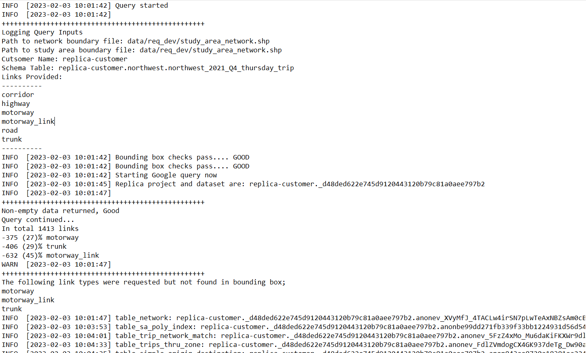

```{r, include = FALSE}
knitr::opts_chunk$set(
  collapse = TRUE,
  comment = "#>",
  warning = FALSE, 
  message = FALSE,
  fig.width = 8.83
)
```

```{r setup, message = FALSE}
# library(replicaToolkitR)
targets::tar_source()
```

## Intro 

This vignette is a deeper dive than the README  `replicaToolkitR`. The goal of this document is not to demonstrate how to acquire, process, and analyze data from Replica using `replicaToolkitR`.


## Set-Up 

Here are the packages you'll need for this vignette. 

```{r message = FALSE, warning=FALSE}
#for widgets
library(crosstalk)
library(reactable)

#tidyverse packages
library(dplyr)
library(forcats)
library(here)
library(magrittr)
library(purrr)
library(readr)
library(stringr)
library(tidyr)

#data manip
library(data.table)
library(log4r)
library(gauntlet) #https://github.com/michaelgaunt404/gauntlet 

#for mapping
library(leafem)
library(leaflet)
library(leaflet.extras2)
library(mapview)
mapviewOptions(homebutton = F)

#for spatial data
library(sf)
library(sfhotspot)
library(SpatialKDE)
library(tigris)

```

## Input Data Overview 

In order to use (whether you are using it or requesting someone else for data), you will need three pieces of data. They are:

+ `Network Study Area:`A polygon layer (GPKG or SHP) detailing the extent of the network you want information for 
  - This polygon is used to spatially filter the network and query trips that only use the network links within this boundary 
  - Any trip that uses the network within this boundary will be acquired and tagged with one of the following labels:
    + `internal-to-internal`: study area to study area trips
    + `internal-to-external`: study area to external trips
    + `external-to-internal`: external to study area trips
    + `external-to-external`: external to external trips (through trips)
+ `Origin/Destination Study Area:` A polygon layer (GPKG or SHP) detailing the extent of the origin polygons you want information  
  - This polygon is used to define the **_study area_** of your analysis
  - In the query process, a trip's origin and destination polygon will be classified as falling within or outside of the **Origin/Destination study area**
  - Polygons within this boundary will be uniquely tracked
  - Polygons falling outside of this boundary will be tagged as **_out of study area_** and treated as one large polygon
  
#### Examples

The following is an example of the polygon that was used to create the `replicaToolkitR's` sample data and the data in this document. 
In this vignette it is simultaneously used as the `Network Study Area` and then `Origin/Destination Study Area`.

```{r fig.width=5, fig.height=4}
data("study_area_network")

mapview(study_area_network)
```

> **Note:** These study area polygons can be as simple or complex as you like. One of the benefits of using this package, is that it enables the user to easly send complicated spatial geometries to Replica's backend database. This is hard to do and arduous via their web portal.

> **Note:** Ideally, study area polygon(s) should be as small as possible for you analysis. This is to: `1)` limit how much data you are pulling down from their database `2)` limit the size of the data objects that will be saved to your local computer and `3)` limit the size of some of the automated data visualiztions and other tools that are created from your queired data.


## Extracting Replica Data

The following code is the main function in `replicaToolkitR`. 

What you are doing in this function:

+ Supplying spatial polygons that will define the network and your study area - e.g. bb_network_layer, bb_sa_layer
+ Point to which Big Query tables you want data from - e.g. network_table, trip_table
+ Where you want this function to write your data to - e.g. file_destination
+ The number of records you want to download for each query 
  - Inf means all and is the default but you can query less 
  - You might want to do less if you just want to test the function or performing EDA
  - This query logs all intermediate query tables that are made, so you can manually download tables later if you want
+ What links you want returned to you 

```{r eval=F}
seattle_study_area = study_area_network
user_links = c(
  "highway", "corridor"
  ,"motorway", "motorway_link"
  ,"trunk", "trunk_link"
  ,"primary", "primary_link")
user_modes = c('COMMERCIAL')

user_location = "northwest"
user_time = "2025_Q2"
user_day = "saturday"

user_path = tempdir()

query_network_trip_using_bbox(
  input_folder_write = user_path
  ,input_folder_suffix = "freight_pull"
  
  ,data_set_location = user_location
  ,data_set_period = user_time
  ,data_set_day = user_day
  
  ,bb_sa_layer = seattle_study_area
  ,bb_network_layer = seattle_study_area
  ,prefix_origin = "start"
  ,prefix_dest = "end"
  ,query_links = user_links
  ,mode_type = user_modes
  
  ,customer_name = "replica-customer"
  ,max_record = Inf
  ,check_aux_tables = F
)


```

> **Note:** I usually omit **_residential_** links as most freight analyses do not care about them and they dramtically increase the amount of data you will download. But your application may need them. 

As you can see in this example, the location of where the networks I supplied the function is and where I want my data to be saved to is **_data/req_dev_**. This will be different for you and you will need to change it accordingly. Make sure it is a relative path and do not include `./` as the function `here::here()` is used within `query_network_trip_using_bbox()` to complete the path fully on your machine.

In addition, at certain points in the querying process the function will ask for your input. You will need to supply input at these times to either continue or terminate the execution of the querying process. 


### Raw Queried Data

At the end the query, `query_network_trip_using_bbox()` will write 6 files to where you specified by the `file_destination` input. More specifically, it will write the data to a sub-folder at that location named `data_[[sys.time of run]]`. 

#### log_file
The first file that is made is the `log_file` and is a simple text file that logs events of the run. This will be made regardless if the run is completed, most importantly it records the table IDs of the temporary tables that are made in Google Big Query table during the run. These can be accessed later.   

It also logs your inputs so you can trace what the inputs where for a given analysis.

{ width=100% }

#### replica_queried_network
The `replica_queried_network` files contain tabular data that can be used to reconstruct the network you queried via user supplied *network study area* and the *query link* vector. Again, this data is saved both in CSV and QS formats.

> **Note:** You will have the option to automatically download it or not. 

```{r}
data("seattleFreight_replica_network_qs")
```

##### Table {.tabset}
```{r echo=FALSE}
seattleFreight_replica_network_qs %>% 
  st_as_sf(wkt = "geometry")
  head(10) %>% 
  select(stableEdgeId, osmid, streetName, highway, lanes, speed ) %>% 
  reactable(
    defaultColDef = colDef(footerStyle = list(fontWeight = "bold"))
    ,height = 250
  ) %>% 
  gauntletReactable::rctble_format_table(defaultPageSize = 10)
```

##### Map
```{r echo=FALSE}
inspect_queried_network(
  network_links_object = seattleFreight_replica_network_qs %>% 
    st_as_sf(wkt = "geometry", crs = 4326)
)
```

{-}


#### replica_study_area_polys
The `replica_study_area_polys` files contain tabular data that can be used to reconstruct the uniquely defined polygons that fall within the  *origin/destination study area*. Again, this data is saved both in CSV and QS formats.

```{r}
data("seattleFreight_replica_study_area_polys_qs")
```

##### Table {.tabset}
```{r echo=FALSE}
seattleFreight_replica_study_area_polys_qs %>% 
  head(10) %>% 
  reactable(
    defaultColDef = colDef(footerStyle = list(fontWeight = "bold"))
    ,height = 250
  ) %>% 
  gauntletReactable::rctble_format_table(defaultPageSize = 10)
```

##### Map
```{r echo=FALSE}
seattleFreight_replica_study_area_polys_qs %>% 
    st_as_sf(wkt = "geom", crs = 4326) %>% 
  mapview(z = "raw_id")

```

{-}

#### replica_trip_origin_destination   

The `replica_trip_origin_destination` contain a dataframe of total number vehicle trips aggregated by origin/destination polygon ID, mode and vehicle type. 

> **Note:** Again, origins and destinations outside of the *origin/destination study area* are collapsed into single level called `out of study area` and is not repersented with spatial geometry.  


```{r}
data("seattleFreight_replica_trip_origin_destination_qs")
```

##### Table {.tabset}
```{r}
seattleFreight_replica_trip_origin_destination_qs %>% 
  reactable(
    defaultColDef = colDef(footerStyle = list(fontWeight = "bold"))
    ,height = 250
  ) %>% 
  gauntletReactable::rctble_format_table(defaultPageSize = 10)
```


##### Map {.tabset}
```{r}
seattleFreight_replica_trip_origin_destination_qs %>% 
    filter(flag_sa_origin == "internal", flag_sa_destination== "internal"
           ,origin_poly != destination_poly
           ,origin_poly == "530330093003"
           ,str_detect(vehicle_type, "MED")) %>% 
  merge(seattleFreight_replica_study_area_polys_qs %>% st_as_sf(wkt = "geom", crs = 4326), .
        ,by.x = "raw_id", by.y = "destination_poly") %>% 
  mapview(z = "count", layer.name = "Total Trips")

```

{-}


#### table_agg_network_vols
The `table_agg_network_vols` files contain tabular detailing link volume aggregated by mode, vehicle type and movement type. 

> **Note:** This table is intended to be a jumping off point for any analysis and provides and immediate high level view of network volumes given basic movement patterns for a particular study area. There are many different ways to aggregate the Replica trip table in order to produce different network usage layers. 

```{r echo=FALSE}
data("seattleFreight_table_agg_network_vols_qs")
```

##### Table {.tabset}
```{r}
seattleFreight_table_agg_network_vols_qs %>% 
   mutate(vehicle_type = str_remove(vehicle_type, "_COMMERCIAL")) %>% 
  reactable(
    defaultColDef = colDef(footerStyle = list(fontWeight = "bold"))
    ,height = 250
  ) %>% 
  gauntletReactable::rctble_format_table(defaultPageSize = 10)
```

##### Map {.tabset}
```{r}
seattleFreight_table_agg_network_vols_qs %>% 
  mutate(vehicle_type = str_remove(vehicle_type, "_COMMERCIAL")) %>% 
  mutate(trip_type = paste0(str_remove(flag_sa_origin, "ernal"), "-", str_remove(flag_sa_destination, "ernal"))) %>% 
  merge(
    seattleFreight_replica_network_qs %>% st_as_sf(wkt = "geometry", crs = 4326), .
    ,by.x = "stableEdgeId", by.y = "network_link_ids_unnested"
  ) %>% 
  group_by(vehicle_type_1 = vehicle_type, trip_type_1 = trip_type) %>% 
group_map(~{
  
  temp_data = .x
  temp_v = unique(temp_data$vehicle_type)
  temp_t = unique(temp_data$trip_type)
  temp_ln = paste0(temp_v, " ", temp_t)
  
  mapview(temp_data, z = "count", lwd = "count", layer.name = temp_ln)
}) %>% 
  reduce(`+`)
 

```

{-}


#### table_trips_subset

The last main pair of files written out by `query_network_trip_using_bbox()` are the `table_trips_subset` tables. These files contain tabular data detailing every trip queried by `query_network_trip_using_bbox()` - effectively a subset of the entire data in the Replica database that meets the input criteria specified by the user. 

Using this table, one can calculate any number of additional analysis statistics by aggregating this tables attributes. E.g. Number of unique trips per within a specified study area, etc.

> **Note:** This is an important table that can be used to extend an analysis past the initial data query. As mentioned, it can be used to develop query level traffic statistics. Furthermore, it can be used to re-query Replica in order to acquire different network volume aggregation layers (see section).


```{r echo=FALSE}
data("seattleFreight_table_trips_subset_qs")
```

##### Table {.tabset}
```{r}
seattleFreight_table_trips_subset_qs %>% 
  head(100) %>% 
  reactable(
    defaultColDef = colDef(footerStyle = list(fontWeight = "bold"))
    ,height = 250
  ) %>% 
  gauntletReactable::rctble_format_table(defaultPageSize = 10)
```

##### Map {.tabset}
```{r}
seattleFreight_table_agg_network_vols_qs %>% 
  mutate(vehicle_type = str_remove(vehicle_type, "_COMMERCIAL")) %>% 
  mutate(trip_type = paste0(str_remove(flag_sa_origin, "ernal"), "-", str_remove(flag_sa_destination, "ernal"))) %>% 
  merge(
    seattleFreight_replica_network_qs %>% st_as_sf(wkt = "geometry", crs = 4326), .
    ,by.x = "stableEdgeId", by.y = "network_link_ids_unnested"
  ) %>% 
  group_by(vehicle_type_1 = vehicle_type, trip_type_1 = trip_type) %>% 
group_map(~{
  
  temp_data = .x
  temp_v = unique(temp_data$vehicle_type)
  temp_t = unique(temp_data$trip_type)
  temp_ln = paste0(temp_v, " ", temp_t)
  
  mapview(temp_data, z = "count", lwd = "count", layer.name = temp_ln)
}) %>% 
  reduce(`+`)
 

```

{-}

### Extending Your Analysis 


#### Additional Network Layers

As alluded to above, the `table_trips_subset` tables can be used to aquire additioanl network layers from Replcia's backend database.

`table_trips_subset` contains a single record for each unique trip that meet the users query inputs and spatial study area criteria. Each trips is uniquely identified by a *activity_id*. The function `rplc_extract_networks_given_activity_id()` takes vectors of *activity_ids* and returns network link volumes for those particular *activity_ids*. This can be perfromed `N` number of times given the number of *activity_ids* groups the user makes.

In the following example, the attribute `time_group` is made from the start time of each trip and relabeling them to 4 hour bins e.g. trips starting during 12AM-4AM, 4AM-8AM and so on.

```{r}
trips_tagged = seattleFreight_table_trips_subset_qs %>%
  dplyr::mutate(time_group = gauntlet::floor_divide(start_local_hour, 4))

unique(trips_tagged$time_group) %>% sort()
```


```{r}
seattleFreight_replica_network_aux_layers = rplc_extract_networks_given_activity_id(
  raw_trip_table = trips_tagged
  ,col_to_split = "time_group"
  ,avoid_str = "0|20"
  ,add_context = "seattle weekend freight"
  ,data_set_location = user_location
  ,data_set_type = user_day
  ,data_set_period = user_time
  ,customer_name = "replica-customer"
)

```

```{r}
data(seattleFreight_replica_network_aux_layers)
```


```{r}
trips_tagged = seattleFreight_table_trips_subset_qs %>%
  dplyr::mutate(time_group = gauntlet::floor_divide(start_local_hour, 4))

unique(trips_tagged$time_group) %>% sort()
```

The query is similar to `query_network_trip_using_bbox()` and the user mush point to the same dataset the *table_trips_subset* originally came from or the *activity_ids* will not match.

In addition, the column which the function wil split on must be provided and if any level should not be queired. In this case, the *time_group* is idetified to the function as the column contained the groups we want to aquire network layers for and to not acquire data for trips starting between 12AM-4AM and 8PM-12PM.

```{r eval = false}
seattleFreight_replica_network_aux_layers = rplc_extract_networks_given_activity_id(
  raw_trip_table = trips_tagged
  ,col_to_split = "time_group"
  ,avoid_str = "0|20"
  ,add_context = "seattle weekend freight"
  ,data_set_location = user_location
  ,data_set_type = user_day
  ,data_set_period = user_time
  ,customer_name = "replica-customer"
)

```

```{r}
data(seattleFreight_replica_network_aux_layers)
```

```{r}
seattleFreight_replica_network_aux_layers %>% 
  merge(
    seattleFreight_replica_network_qs %>% st_as_sf(wkt = "geometry", crs = 4326), .
    ,by.x = "stableEdgeId", by.y = "network_link_ids_unnested"
  ) %>% 
  group_by(split_col_value_1 = split_col_value) %>% 
  group_map(~{
    temp_data = .x
    temp_ln = unique(temp_data$split_col_value) %>% paste(., " hour")
    
    mapview(temp_data, z = "count", lwd = "count", layer.name = temp_ln)
  }) %>% 
  reduce(`+`)
```


As eluded to above, the function `query_network_trip_using_bbox()` extracts, pre, and saves Replica data to your computer. `replicaToolkitR` provides additional helper functions that process the data further into a format that is more conducive to mapping and commonly performed analyses (OD analysis, etc.). 

These functions and the data processing workflow are described in this section.

> **Note:** The functions in this section can be supplied an object to transfrom or location and folder inputs that point to where your data is saved. If the latter is supplied then the function will go and automatically load whatever file the function calls for. Suppling an object directly is compataible with the targets package workflow.
>
> Additionally, each function can be told to automatically save the resulting processed data to the same location/folder as the raw data.


```{r eval=FALSE}

# #### Acquiring Study Area Polygons
# 
# This function `get_tigris_polys_from_replica_index()` takes the raw data `replica_sa_poly_index` and uses it to acquire more detailed versions of this from the US Census site. 
# 
# It grabs the polygons within your study area using the TIGRIS API. These polygons are more detailed the ones from Replica and contain attributes such as land and water area which can help out when calculating trip densities for origin or destination polygons.
# data("replica_sa_poly_index")
# 
# yolo = get_tigris_polys_from_replica_index(
#   network_object = replica_sa_poly_index
#   ,states = "WA"
#   ,auto_save = F
# )

# data("acquired_sa_polys")
# 
# mapview(acquired_sa_polys)
```

#### Network Processing

Producing different network layers is a vital component of the `ReplicaToolkitR` workflo but working with the raw network related tables can be tedious. `ReplicaToolkitR` provides a number of helper functions that process the tabular network data saved by `query_network_trip_using_bbox()` into a more useable format.

`make_network_link_layer():` performs some basic reprocessing and attribute creation and produces a poline representation of the network.
`make_network_centroid_layer():` performs some basic reprocessing and attribute creation and produces a point representation of the network.

Why the difference - polyline networks are fundemental to network maps and repersent the network as it exists. However, polylines can not be used when making client-side, filterable and interactive crosstalk/leaflet widget unlike point. By repersenting the network by their link centroids, one can used the sweet of visualization tools provided by `ReplicaToolkitR` to create interactive leaflet maps displaying network usage.

> **Note:** `make_network_link_layer()` must be ran before `make_network_centroid_layer()`. 

```{r eval=F}
#note: both functions can be supplied a network obj or a folder to read network object from
data("seattleFreight_replica_network_qs")
make_network_link_layer(
  network_object = seattleFreight_replica_network_qs
  , auto_save = F)

data("seattleFreight_replica_network_links")
make_network_centroid_layer(
  network_object = seattleFreight_replica_network_links
  ,auto_save = F)
```

```{r echo=F}
data("replica_queried_network_links")
data("replica_queried_network_cntds")
```

Below is a sample of both the network link poly-lines and network link midpoints. 
```{r fig.width=5, fig.height=4}
replica_queried_network_links_m = seattleFreight_replica_network_links %>%  
  filter(highway == "motorway")
replica_queried_network_cntds_m = seattleFreight_replica_network_points %>%  
  filter(highway == "motorway")

mapview(replica_queried_network_cntds_m
        ,layer.name = "Network Links") + 
  mapview(replica_queried_network_links_m
          ,layer.name = "Network Points")
```

Once you create `replica_queried_network_links`, you can inspect it using the helper function `inspect_queried_network()`. It is often helpful to look at the links you acquired as Replica labels each link with their own **_highway_** tag which you may be unfamiliar with. 

> **Note:** This is a standalone HTML widget that will open up in your RStudio viewer, I have embedded in this documnet for clarity.

```{r fig.width=5, fig.height=4}
# inspect_queried_network(
#   network_links_object = replica_queried_network_links
# )
```

#### aggregated_network_links

The last main processing function in `replicaToolkitR` is `aggregate_networkpkgdo_links()`. As mentioned earlier, this function aggregates the tabular network link volume data a number of different ways - by trip type, vehicle type, and by origin and trip type. In addition, it merges the network link mid-point object, `replica_queried_network_cntds`, to the aggregated data frames to make spatial objects depicting network link volumes by their mid-points. 

This object is saved out as an RDS list object, containing each aggregated network object in a list that can be indexed when loaded. 

```{r eval=F}
data("table_agg_by_link_subset_limited")
data("poi_list")
data("replica_queried_network_cntds")

aggregate_network_links(
  agg_count_object = table_agg_by_link_subset_limited
  ,poi_list = poi_list
  ,network_object = replica_queried_network_cntds
)

```

## Analysis Tools

Lastly, as stated before, the intent of this package is to streamline the Replica workflow, making it as easy as possible to ask a question, get data, and begin to extract meaningful insights.

`replicaToolkitR` provides additional helper functions that automatically create interactive, filterable dashboard-like objects of your data. These helper tools and visualization products make it easy for you to further slice and inspect your data without going though the repetitive steps of coding this yourself or putting it into other programs. 

There are specific helper functions to visualize each network volume aggregation object. 

```{r eval=FALSE}
data("aggregated_network_links")
data("poi_list")
data("acquired_sa_polys")

make_network_map_anltpt(
  network_cntrd_object = aggregated_network_links
  ,poi_list = poi_list
  ,origin_polys = acquired_sa_polys
)

make_network_map_anlt(
  network_cntrd_object = aggregated_network_links
  ,poi_list = poi_list
  ,origin_polys = acquired_sa_polys
)

make_network_map_anlto(
  network_cntrd_object = aggregated_network_links
  ,poi_list = poi_list
  ,origin_polys = acquired_sa_polys
)

```

Below is a static image of the interactive dashboard.

{ width=100% }


